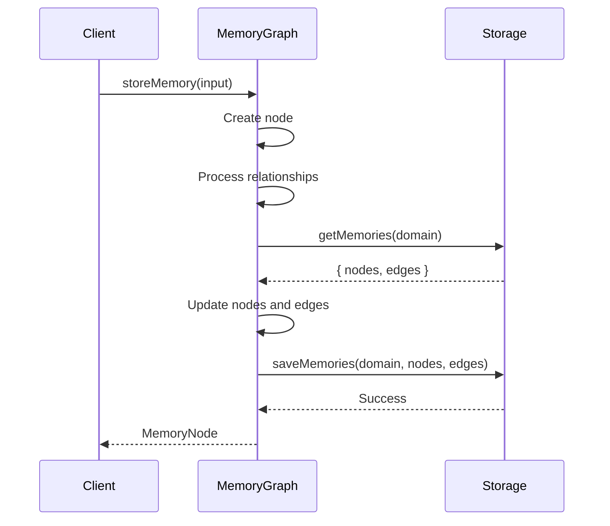
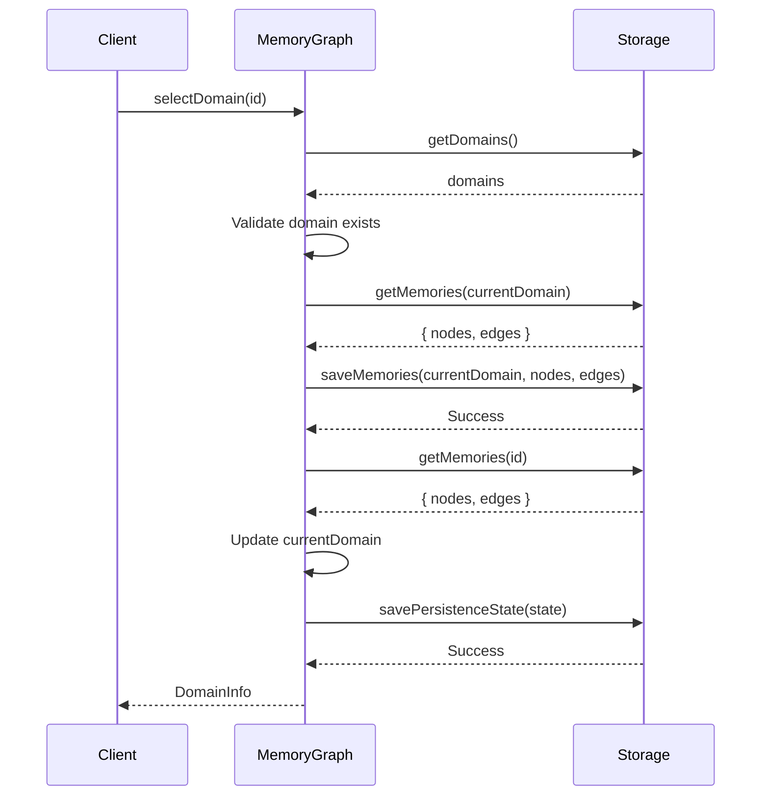

# Memory Graph Architecture

This document provides an overview of the Memory Graph MCP server architecture, designed for developers who want to understand, maintain, or extend the codebase.

## System Architecture

The Memory Graph MCP is structured around several core components that work together to provide persistent memory capabilities through a graph-based approach:

```
┌────────────────────────────────────────────────────────┐
│                   Transport Layer                      │
│          (StdioServerTransport / HttpTransport)        │
└───────────────────────────┬────────────────────────────┘
                            │
                            ▼
┌────────────────────────────────────────────────────────┐
│                      MCP Server                        │
│                   (JSON-RPC Handler)                   │
└───────────────────────────┬────────────────────────────┘
                            │
                            ▼
┌────────────────────────────────────────────────────────┐
│                     Memory Tools                       │
│           (Tool Implementations and Handlers)          │
└───────────────────────────┬────────────────────────────┘
                            │
                            ▼
┌────────────────────────────────────────────────────────┐
│                    Memory Graph                        │
│           (Graph Model and Operations)                 │
└───────────────────────────┬────────────────────────────┘
                            │
                            ▼
┌────────────────────────────────────────────────────────┐
│                    Storage Layer                       │
│          (JSON, SQLite, MariaDB Storage)               │
└────────────────────────────────────────────────────────┘
```

### Core Components

#### 1. Transport Layer

The transport layer handles communication between clients and the server using different protocols:

- **StdioServerTransport**: Processes JSON-RPC messages over stdin/stdout
- **HttpTransport**: Exposes a RESTful HTTP API for JSON-RPC communication

Key files:
- `src/index.ts`: Transport initialization and server setup

#### 2. MCP Server

The MCP Server component implements the Model Context Protocol (MCP) server interface, handling:

- JSON-RPC message parsing and validation
- Tool dispatch and execution
- Response formatting and error handling

Key files:
- `src/index.ts`: MCP server configuration and initialization

#### 3. Memory Tools

The Memory Tools component defines and implements the tools exposed through the MCP interface:

- Tool definitions with input schemas
- Tool handlers and implementation logic
- Error handling and validation

Key files:
- `src/tools/memoryTools.ts`: Tool definitions and handlers
- `src/tools/memoryTools.test.ts`: Tool tests

#### 4. Memory Graph

The Memory Graph component implements the core graph data model and operations:

- Memory node and edge management
- Domain management and cross-domain operations
- Graph traversal and search operations
- Mermaid visualization generation

Key files:
- `src/graph/MemoryGraph.ts`: Main graph implementation
- `src/graph/MemoryGraph.test.ts`: Graph tests
- `src/graph/MermaidGenerator.ts`: Graph visualization
- `src/graph/MermaidGenerator.test.ts`: Visualization tests

#### 5. Storage Layer

The Storage Layer provides abstract and concrete implementations for different storage backends:

- Common storage interface definition
- Implementation-specific storage logic
- Data persistence and retrieval operations

Key files:
- `src/storage/MemoryStorage.ts`: Storage interface
- `src/storage/JsonMemoryStorage.ts`: JSON file-based storage
- `src/storage/SqliteMemoryStorage.ts`: SQLite database storage
- `src/storage/MariaDbMemoryStorage.ts`: MariaDB database storage
- `src/storage/DatabaseStorage.ts`: Common SQL database functionality
- `src/storage/StorageFactory.ts`: Factory for creating storage instances

## Design Patterns

The Memory Graph MCP codebase uses several design patterns:

### 1. Repository Pattern

The Memory Storage interface and implementations follow the Repository pattern, abstracting data access:

```typescript
export interface MemoryStorage {
  initialize(): Promise<void>;
  getDomains(): Promise<Map<string, DomainInfo>>;
  saveDomains(domains: Map<string, DomainInfo>): Promise<void>;
  // ... other data access methods
}
```

This pattern allows the system to:
- Abstract away storage implementation details
- Swap storage backends without changing business logic
- Test business logic with mock storage implementations

### 2. Factory Pattern

The StorageFactory class implements the Factory pattern to create specific storage implementations:

```typescript
export class StorageFactory {
  static createStorage(type: StorageType, storageDir: string, dbConfig?: PoolOptions): MemoryStorage {
    switch (type) {
      case StorageType.JSON:
        return new JsonMemoryStorage(storageDir);
      case StorageType.SQLITE:
        return new SqliteMemoryStorage(storageDir);
      case StorageType.MARIADB:
        return new MariaDbMemoryStorage(storageDir, dbConfig);
      default:
        throw new Error(`Unknown storage type: ${type}`);
    }
  }
}
```

This pattern provides:
- Centralized creation logic for storage instances
- Encapsulation of implementation-specific details
- Easy extension for new storage types

### 3. Strategy Pattern

The MCP tools implement the Strategy pattern, with different strategies for memory recall:

```typescript
// Different strategies for memory recall
export type RecallStrategy = 
  | 'recent'           // Get most recent memories
  | 'related'          // Follow relationships from a starting point
  | 'path'             // Filter by path
  | 'tag'              // Filter by tags
  | 'content'          // Search by content
  | 'combinedStrategy'; // Multiple strategies together
```

Each strategy has a specific implementation, allowing:
- Flexible selection of recall behavior at runtime
- Easy addition of new recall strategies
- Clear separation of different recall algorithms

### 4. Abstract Factory Pattern

The DatabaseStorage abstract class implements the Abstract Factory pattern for SQL database operations:

```typescript
export abstract class DatabaseStorage implements MemoryStorage {
  protected abstract getConnection(): Promise<any>;
  
  // Common implementations for SQL databases
  async getDomains(): Promise<Map<string, DomainInfo>> {
    // Implementation that calls abstract methods
  }
  
  // Abstract methods that concrete classes must implement
  protected abstract executeQuery(sql: string, params?: any[]): Promise<any>;
}
```

This pattern enables:
- Shared implementation for common database operations
- Specialized implementations for database-specific features
- Code reuse across different SQL database backends

## Key Interfaces

### MemoryGraph Interface

The core API for memory graph operations:

```typescript
export interface MemoryGraphInterface {
  // Domain operations
  createDomain(id: string, name: string, description: string): Promise<DomainInfo>;
  selectDomain(id: string): Promise<DomainInfo>;
  listDomains(): Promise<{ current: string; domains: DomainInfo[] }>;
  
  // Memory operations
  storeMemory(input: StoreMemoryInput): Promise<MemoryNode>;
  recallMemories(input: RecallMemoriesInput): Promise<RecallResult>;
  editMemory(input: EditMemoryInput): Promise<MemoryNode>;
  forgetMemory(id: string, cascade?: boolean): Promise<void>;
  
  // Graph operations
  generateMermaidGraph(input: MermaidGraphInput): Promise<string>;
  searchContent(query: string, domain?: string, maxResults?: number): Promise<MemoryNode[]>;
  traverseMemories(input: TraverseMemoriesInput): Promise<TraverseResult>;
}
```

### MemoryStorage Interface

The abstract interface for different storage implementations:

```typescript
export interface MemoryStorage {
  // Initialization
  initialize(): Promise<void>;
  
  // Domain operations
  getDomains(): Promise<Map<string, DomainInfo>>;
  saveDomains(domains: Map<string, DomainInfo>): Promise<void>;
  createDomain(domain: DomainInfo): Promise<void>;
  
  // State operations
  getPersistenceState(): Promise<PersistenceState>;
  savePersistenceState(state: PersistenceState): Promise<void>;
  
  // Memory operations
  getMemories(domain: string): Promise<{ nodes: Map<string, MemoryNode>, edges: GraphEdge[] }>;
  saveMemories(domain: string, nodes: Map<string, MemoryNode>, edges: GraphEdge[]): Promise<void>;
  
  // Search operations
  searchContent(query: string, domain?: string, maxResults?: number): Promise<MemoryNode[]>;
}
```

### Tool Interfaces

The MCP tool interface definitions:

```typescript
export interface MemoryToolInterface {
  handleToolCall(call: ToolCall): Promise<ToolResponse>;
}

export interface ToolCall {
  name: ToolName;
  input: Record<string, any>;
}

export interface ToolResponse {
  content: ToolResponseContent[];
}
```

## Flow Diagrams

### Memory Storage



### Domain Selection



## Extension Points

The Memory Graph MCP is designed to be extensible. Here are key extension points:

### 1. New Storage Backends

To add a new storage backend:

1. Implement the `MemoryStorage` interface
2. Add the new storage type to `StorageType` enum
3. Update `StorageFactory` to create the new implementation
4. Update configuration handling in `index.ts`

### 2. New Memory Tools

To add a new memory tool:

1. Add tool definition to `MEMORY_TOOLS` in `memoryTools.ts`
2. Implement handler method in `MemoryTools` class
3. Add input type definition in appropriate type file
4. Add case to `handleToolCall` switch statement

### 3. New Transport Types

To add a new transport type:

1. Create new transport implementation
2. Add transport type to configuration options
3. Update server initialization in `index.ts`
4. Add appropriate transport-specific error handling

### 4. Additional Recall Strategies

To add a new memory recall strategy:

1. Add new strategy to `RecallStrategy` type
2. Implement strategy-specific logic in `recallMemories` method
3. Update input validation for the new strategy
4. Add appropriate parameters to `RecallMemoriesInput` interface

## Testing Strategy

The codebase follows a testing strategy that includes:

1. **Unit Tests**: Testing individual components in isolation
2. **Integration Tests**: Testing interactions between components
3. **Storage Tests**: Testing specific storage implementations

Key testing patterns:

- Test storage operations with temporary directories
- Use in-memory SQLite for database tests
- Test domain isolation with multiple test domains
- Verify relationship traversal with complex graph setups

## Implementation Notes

### JSON Storage

- One file per domain in the memories directory
- Simple operation with direct file I/O
- Good for development and small deployments

### SQLite Storage

- Single database file for all domains
- Uses SQLite's FTS5 for full-text search
- Uses triggers to maintain search index

### MariaDB Storage

- Client-server database storage
- Uses connection pooling for efficiency
- Implements FULLTEXT search for content

### Configuration Loading

- Environment variables for all configuration options
- Fallback to sensible defaults
- Support for multiple storage and transport types