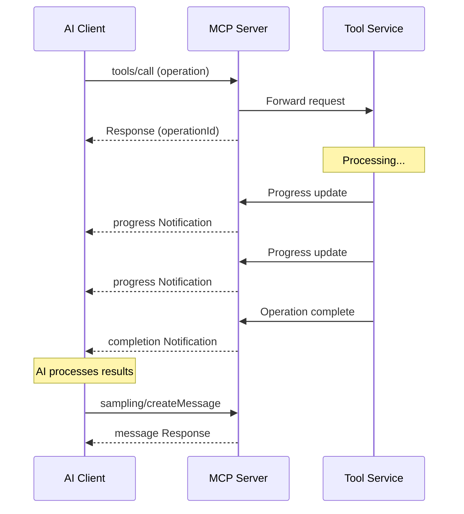

# Asynchronous Tool Communication in MCP

## Overview

This document provides a technical overview of how a long-running asynchronous tool call works in the Model Context Protocol (MCP), including how to check its status and how it can send messages back to the AI without user input.

## How It Works

The MCP protocol is designed to handle long-running operations through its asynchronous communication capabilities. Here's how this works:

1. **Initial Request**: The AI client initiates a tool call using the `tools/call` method with specific parameters
2. **Immediate Response**: The server acknowledges the request and returns a response with a unique operation ID
3. **Progress Notifications**: The server sends progress updates through notifications
4. **Completion Notification**: When finished, the server sends a completion notification with results
5. **AI Processing**: The AI client can process these notifications and decide next actions without user input

## Transaction Diagram



## Technical Implementation Details

1. **Initiating the Async Call**:
   ```json
   {
     "jsonrpc": "2.0",
     "id": "request-123",
     "method": "tools/call",
     "params": {
       "name": "longRunningOperation",
       "arguments": { /* operation parameters */ }
     }
   }
   ```

2. **Server Response with Operation ID**:
   ```json
   {
     "jsonrpc": "2.0",
     "id": "request-123",
     "result": {
       "operationId": "op-456"
     }
   }
   ```

3. **Progress Notifications** (Server to Client):
   ```json
   {
     "jsonrpc": "2.0",
     "method": "$/progress",
     "params": {
       "operationId": "op-456",
       "progress": {
         "percentage": 25,
         "message": "Processing data..."
       }
     }
   }
   ```

4. **Completion Notification** with Results:
   ```json
   {
     "jsonrpc": "2.0",
     "method": "$/completed",
     "params": {
       "operationId": "op-456",
       "result": { /* operation results */ }
     }
   }
   ```

5. **AI Decision Based on Tool Results** (Client creates a new message):
   ```json
   {
     "jsonrpc": "2.0",
     "id": "request-789",
     "method": "sampling/createMessage",
     "params": {
       "content": "Based on operation results, next steps are..."
     }
   }
   ```

## Checking Status

To check on a long-running operation, the client can:

1. **Store the operationId** when the operation is initiated
2. **Listen for notifications** with that operationId
3. **Explicitly request status** using a status request method if supported by the server

## Key Benefits

The key advantage of this approach is that the AI client can autonomously process updates from tools and take appropriate actions without requiring user input at each step of the long-running process. This enables more fluid interactions and allows AI agents to handle complex workflows that involve time-consuming operations.

## Implementation Considerations

- **Error Handling**: Implement proper error handling for failed operations
- **Timeout Management**: Consider implementing timeouts for operations that take too long
- **Notification Queue**: Design a queue system to handle multiple concurrent operations
- **State Management**: Maintain state to track progress of different operations

With these mechanisms in place, MCP enables sophisticated AI-tool interactions that can evolve without constant user intervention, creating more powerful and autonomous AI agent capabilities.
