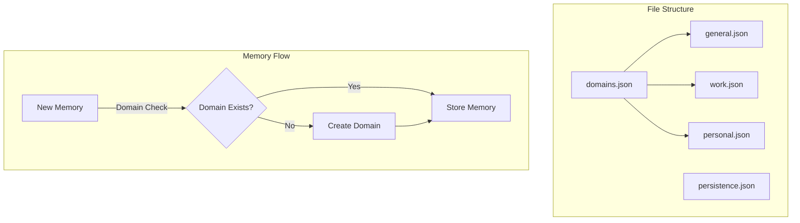
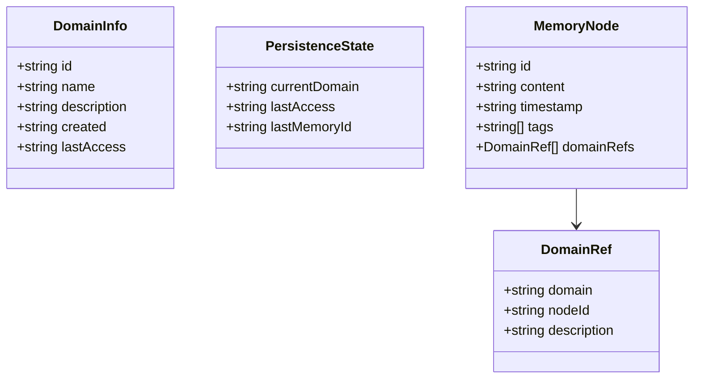
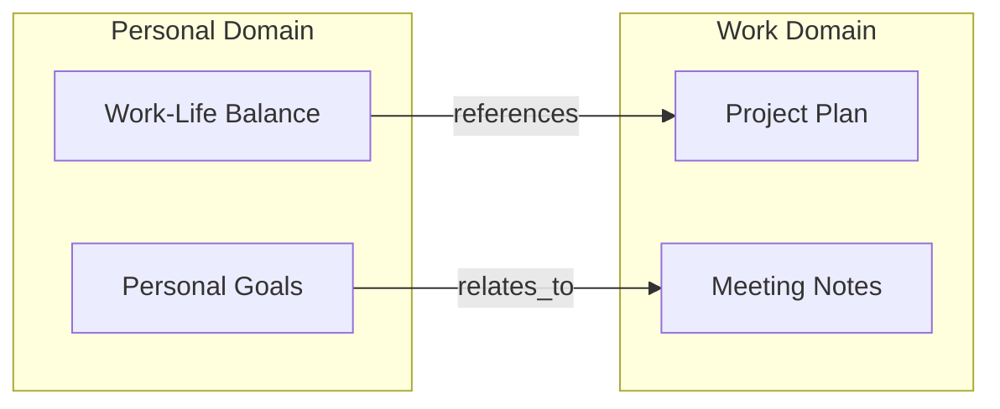
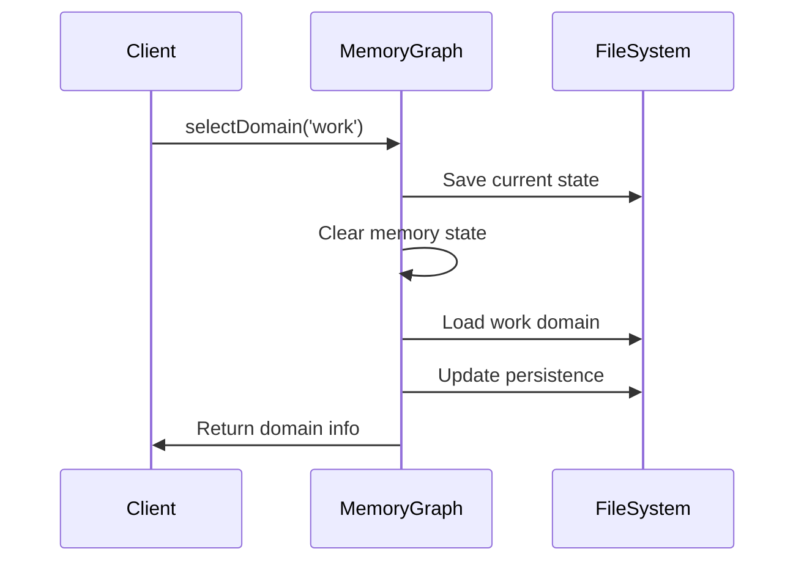
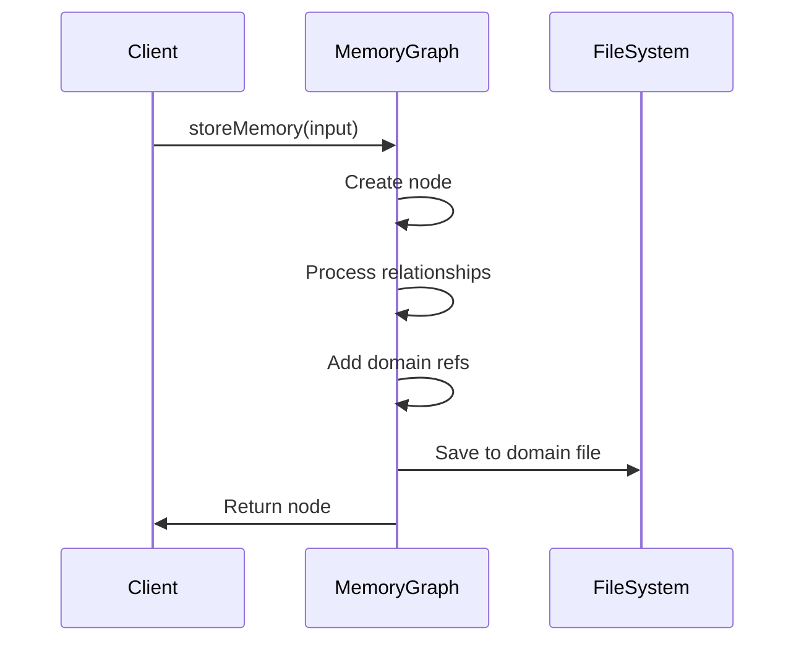
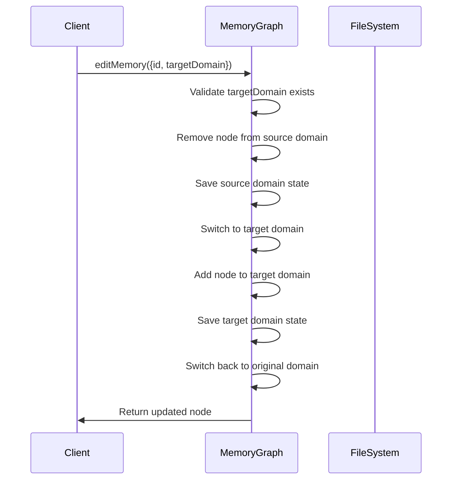
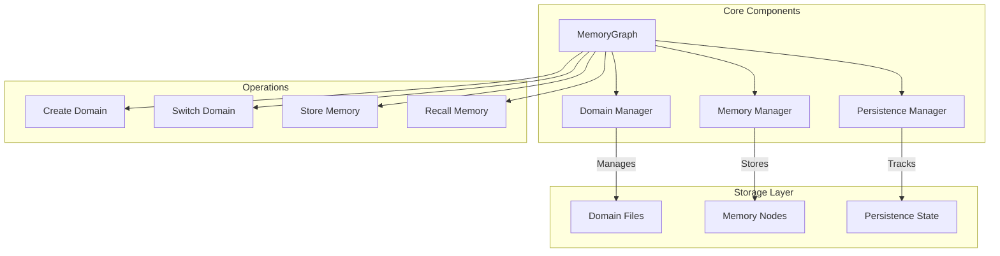

# Memory Architecture

The memory system uses a domain-based architecture to organize and manage memories effectively. This document explains the core concepts and implementation details.

## Domain-Based Organization

Memories are organized into domains to provide logical separation and context-specific storage. Each domain represents a distinct context or category of memories.



### File Structure

The system maintains three types of files:

1. `domains.json`: Master list of all memory domains
2. `persistence.json`: Session state tracking
3. `memories/{domain}.json`: Domain-specific memory files



## Cross-Domain References

Memories can reference nodes in other domains while maintaining domain isolation. This enables creating connections across contexts while keeping the primary organization clean.



## Memory Operations

### Domain Selection


### Memory Storage


### Memory Domain Transfer


## Usage Examples

### Creating a Domain
```typescript
await graph.createDomain(
  'work',
  'Work Domain',
  'Work-related memories'
);
```

### Storing Cross-Domain Memory
```typescript
// Store memory in work domain
const workMemory = await graph.storeMemory({
  content: 'Important project deadline'
});

// Reference work memory from personal domain
await graph.selectDomain('personal');
await graph.storeMemory({
  content: 'Need to balance project work with personal time',
  domainRefs: [{
    domain: 'work',
    nodeId: workMemory.id,
    description: 'Related work project'
  }]
});
```

### Moving Memory Between Domains
```typescript
// Move a memory from the current domain to the 'archives' domain
await graph.editMemory({
  id: 'memory123',
  targetDomain: 'archives'
});

// Edit content and move to another domain in one operation
await graph.editMemory({
  id: 'memory456',
  content: 'Updated content with new information',
  summary: 'Updated project notes',
  targetDomain: 'projects'
});
```

## Best Practices

1. **Domain Organization**
   - Create domains for distinct contexts (work, personal, learning, etc.)
   - Use the general domain for memories that don't fit a specific context
   - Keep domain purposes clear and well-defined

2. **Cross-Domain References**
   - Use sparingly to maintain domain clarity
   - Include descriptive reference text to explain relationships
   - Consider domain boundaries when creating connections

3. **Memory Management**
   - Work primarily in one domain at a time
   - Use tags within domains for finer categorization
   - Regularly review and maintain domain organization

## Implementation Details

The domain-based architecture is implemented through several key components:



### Key Features

1. **Domain Isolation**
   - Each domain has its own memory file
   - Memory operations are scoped to current domain
   - Cross-domain references maintain isolation

2. **State Management**
   - Automatic persistence of session state
   - Last used domain restoration
   - Memory state preservation during switches

3. **Error Handling**
   - Domain existence validation
   - File system error recovery
   - Reference integrity checks
